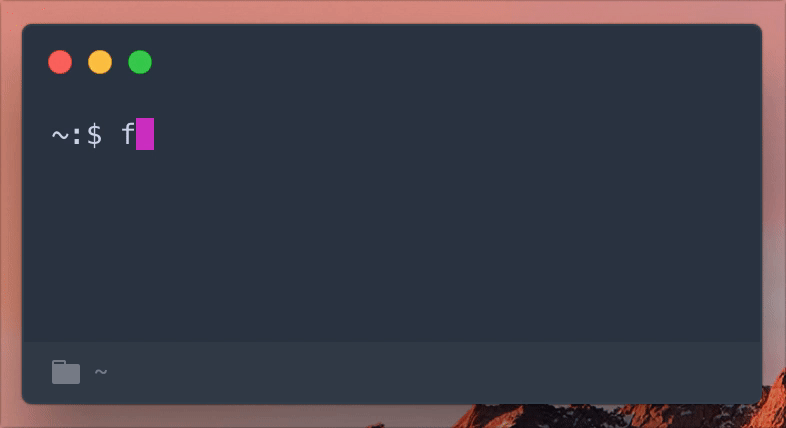

# Terminal Weather

Terminal Weather is a easily accesible terminal based weather station.

Receive the weather forcast, either by hour or forcast from current location or query a certain place. 

## Table of Contents
- [Install](#1-install)
  - [Requirements](#11-requirements)
- [Usage](#2-usage)

## Install
This is install guide

### Requirements
This is requirements for installation

## Usage
This is usage. 
